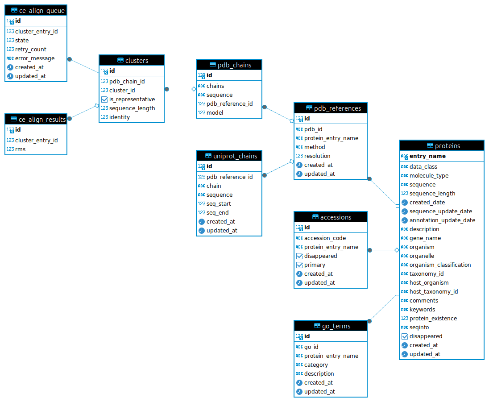

ORM Model
==========

This section provides detailed documentation of the Object-Relational Mapping (ORM) models used in the Protein Data Handler. Each model represents a table in the database and is crucial for managing and storing protein data efficiently.

ER Diagram
==========

Protein
-------

.. autoclass:: protein_data_handler.sql.model.Protein
   :members:
   :show-inheritance:

Accession
---------

.. autoclass:: protein_data_handler.sql.model.Accession
   :members:
   :show-inheritance:

PDBReference
------------

.. autoclass:: protein_data_handler.sql.model.PDBReference
   :members:
   :show-inheritance:

UniprotChains
-------------

.. autoclass:: protein_data_handler.sql.model.UniprotChains
   :members:
   :show-inheritance:

Cluster
-------

.. autoclass:: protein_data_handler.sql.model.Cluster
   :members:
   :show-inheritance:

PDBChains
---------

.. autoclass:: protein_data_handler.sql.model.PDBChains
   :members:
   :show-inheritance:

CEAlignResults
--------------

.. autoclass:: protein_data_handler.sql.model.CEAlignResults
   :members:
   :show-inheritance:

GOTerm
------

.. autoclass:: protein_data_handler.sql.model.GOTerm
   :members:
   :show-inheritance:

